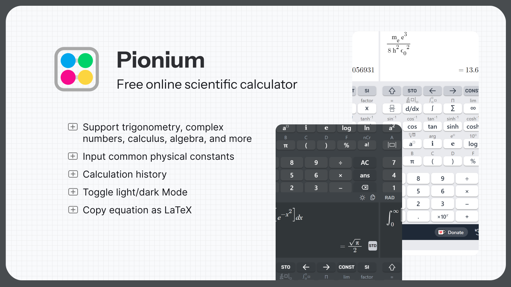
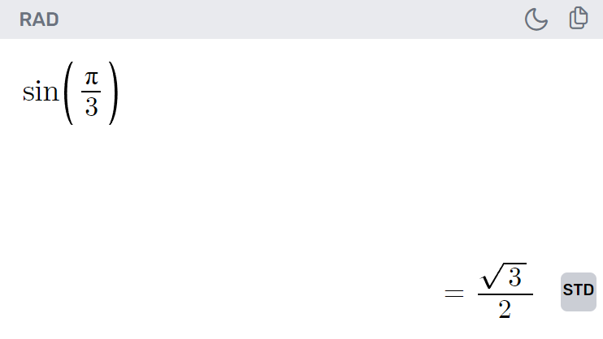
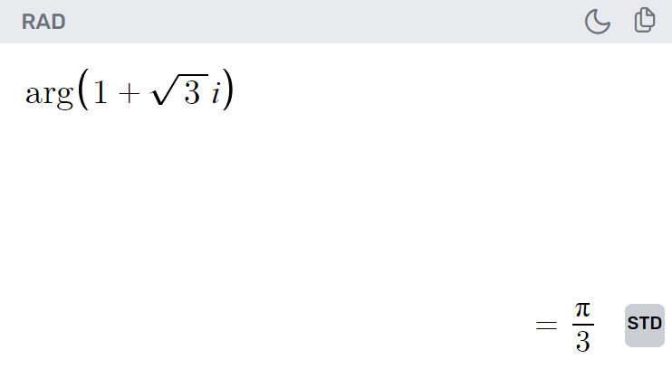
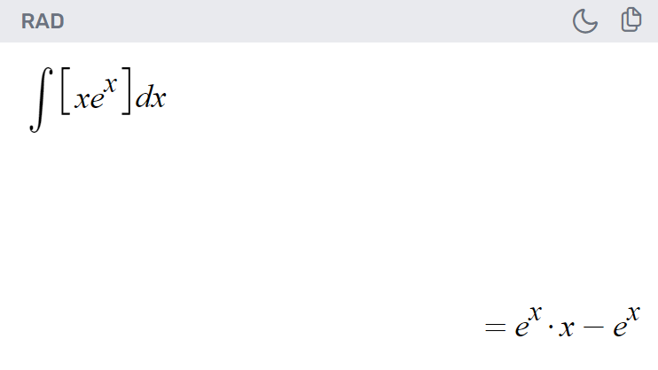
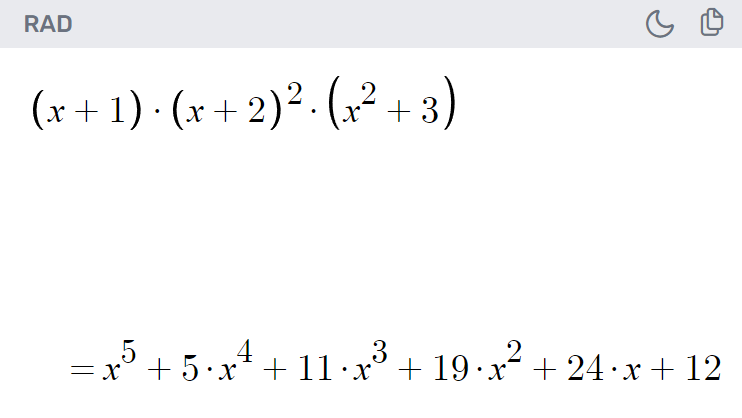
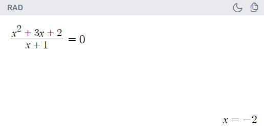
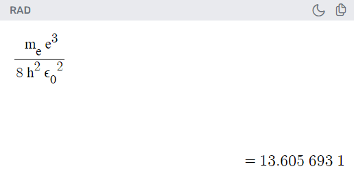

# Pionium Scientific Calculator

Link: [pionium.app](pionium.app)

## Description

Pionium is a beautiful and simple, free online scientific calculator designed for use in Physics, Mathematics and Engineering.

## Supported operations

- Trigonometric and hyperbolic trigonometric functions: sin, cos, sinh, cosh, etc.

  

- Complex number operations: including modulus and argument

  

- Calculus (still with limited functionality): differentiation, integration, sum, and product

  

- Algebraic operation (univariate): including factor

  

- Equation solve (univariate): solve mode is automatically detected by including = (equals sign) in the input

  

- Inputting physical constants and SI prefixes

  

## Features

- Toggle light/dark mode
- Copy equation as LaTeX
- Store variables
- Calculation history

## Contributing

Feature suggestions and bug reports are welcome.
